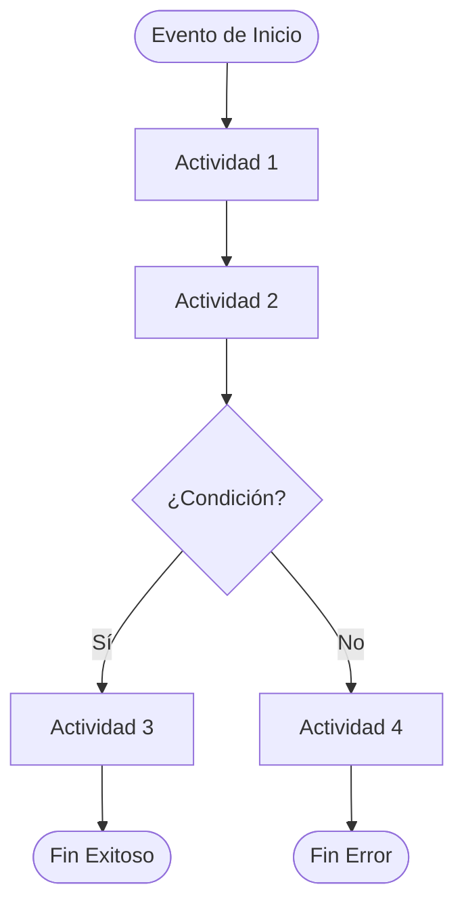
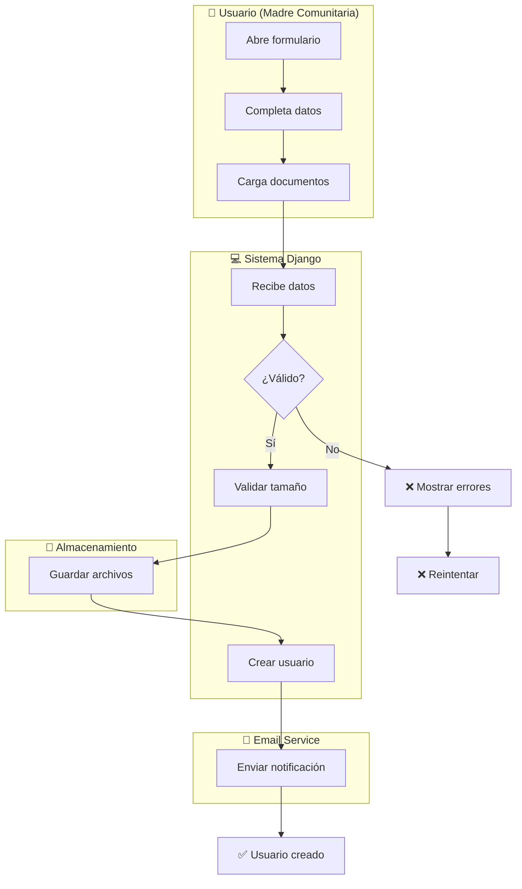

# PROMPT ESPECÍFICO: Diagrama BPMN 2.0 - Sistema ICBF Conecta

**Contexto:** Sistema Django 5.2 de gestión integral para el Instituto Colombiano de Bienestar Familiar  
**Estándar Aplicable:** BPMN 2.0 / ISO/IEC 19510  
**Objetivo:** Generar diagrama de procesos profesional del flujo real del sistema

---

## 🎯 TAREA PRINCIPAL

Genera **UN diagrama BPMN 2.0 profesional** que represente **el proceso [PROCESO_A_DIAGRAMAR]** del sistema ICBF Conecta.

El diagrama **DEBE cumplir estrictamente** con los principios formales de BPMN 2.0 y describir el flujo real del sistema, no pantallas sueltas.

---

## 📌 CONTEXTO DEL SISTEMA

### Sistema ICBF Conecta - Componentes Clave

**Apps principales:**
- `core/` → Autenticación, usuarios, modelos centrales (Usuario, Hogar, Niño)
- `planeaciones/` → Diseño curricular, planeaciones educativas
- `desarrollo/` → Evaluaciones infantiles, seguimiento diario
- `correos/` → Envío de emails, logs de comunicación
- `notifications/` → Sistema de alertas y notificaciones
- `novedades/` → Eventos/incidentes reportados
- `asistencia/` → Control de asistencia

**Actores principales:**
- **Usuario humano:** Administrador, Madre Comunitaria, Padre
- **Sistema:** Django backend, BD SQLite, ORM Django
- **Servicios externos:** SMTP (email), Filesystem (/media/), APScheduler (tareas)

**Patrones técnicos IMPORTANTES (¡NO incluir en diagrama!):**
- `@rol_requerido` decorador (pero SÍ mostrar validación de rol)
- `FileSizeValidationMixin` (pero SÍ mostrar validación de archivo < 5MB)
- Signals `post_save` / `pre_delete` (pero SÍ mostrar acciones que disparan)
- Cascadas AJAX (pero SÍ mostrar carga dinámica de ubicaciones)
- xhtml2pdf (pero SÍ mostrar "generar PDF")
- EmailMessage / SMTP (pero SÍ mostrar "enviar email")

---

## ✅ PROCESOS DISPONIBLES PARA DIAGRAMAR

**Elige UNO de estos procesos o especifica otro:**

1. **Login y Acceso al Sistema**
   - Evento inicio: Usuario ingresa credenciales
   - Fin: Usuario accede a dashboard según rol

2. **Inscripción de Madre Comunitaria** ⭐
   - Evento inicio: Solicitud de inscripción recibida
   - Fin: Usuario creado y email de bienvenida enviado

3. **Crear Planeación Educativa** ⭐
   - Evento inicio: Madre comunitaria abre formulario
   - Fin: Planeación guardada y registrada en sistema

4. **Evaluación Multidimensional del Niño**
   - Evento inicio: Madre abre formulario de evaluación
   - Fin: Evaluación guardada con historial acumulativo

5. **Generación de Reporte PDF (Desarrollo)**
   - Evento inicio: Usuario solicita descargar reporte
   - Fin: PDF descargado o guardado en media

6. **Gestión de Solicitud de Matriculación**
   - Evento inicio: Padre crea solicitud
   - Fin: Solicitud aprobada/rechazada y notificación enviada

7. **Sistema de Notificaciones y Emails**
   - Evento inicio: Evento de negocio ocurre
   - Fin: Usuario recibe notificación en sistema y/o email

8. **Carga Dinámica Cascada de Ubicaciones**
   - Evento inicio: Usuario selecciona Departamento
   - Fin: Barrio se carga y está disponible para seleccionar

---

## 📋 FASE 1: IDENTIFICAR ACTORES

**Antes de generar el diagrama, enumera TODOS los actores:**

```
ACTORES IDENTIFICADOS PARA [PROCESO]:

1. [Nombre Actor] - [Tipo: Humano/Sistema/Externo]
   Responsabilidad: [Qué hace en este proceso]
   Acciones típicas: [Verbos que ejecuta]

2. [...]
```

**Ejemplos de actores (NO cometer el error de mezclar):**

```
❌ INCORRECTO (confunde responsabilidades)
- Usuario → Valida datos en formulario
- Sistema → Muestra pantalla

✅ CORRECTO (responsabilidades claras)
- Usuario → Completa formulario y hace click en Enviar
- Sistema → Recibe datos, valida y procesa
- BD → Guarda registro
- Email Service → Envía notificación
```

---

## 📋 FASE 2: PROCESOS PRINCIPALES

**Define el proceso de forma clara:**

```
PROCESO: [Nombre completo del proceso]

INICIO: [¿Qué evento gatilla exactamente?]
        [Ejemplo: "Usuario abre formulario de inscripción"]

OBJETIVO: [¿Qué debe lograrse?]
          [Ejemplo: "Validar datos y crear usuario madre comunitaria"]

FIN ESPERADO: [¿Cuál es el resultado final?]
              [Ejemplo: "Usuario creado, email enviado, carpeta media creada"]

ACTORES INVOLUCRADOS: 
- [Actor 1 y su rol]
- [Actor 2 y su rol]
- [...]
```

---

## 📋 FASE 3: DECISIONES CRÍTICAS

**Enumera TODAS las decisiones/gateways del proceso:**

```
DECISIONES CRÍTICAS EN [PROCESO]:

1. [Gateway 1]: ¿[Condición a evaluar]?
   ├─ Sí/Condición cumple → [Siguiente actividad]
   └─ No/Condición NO cumple → [Actividad alternativa]

2. [Gateway 2]: ¿[Condición]?
   ├─ Opción A → [...]
   ├─ Opción B → [...]
   └─ Opción C → [...]

3. [...]
```

**Ejemplos de decisiones REALES en ICBF Conecta:**

```
✅ CORRECTO (específico del negocio)
- ¿Usuario tiene rol = madre_comunitaria?
- ¿Archivo de cédula < 5MB?
- ¿Hogar tiene cupo disponible?
- ¿Antecedentes válidos?
- ¿Email ya existe en sistema?

❌ INCORRECTO (vago o técnico)
- ¿Validar?
- ¿Procesar?
- ¿Guardar en BD?
```

---

## 📋 FASE 4: VALIDACIÓN DE COHERENCIA

**Antes de generar, valida ESTAS 11 reglas:**

```
CHECKLIST DE COHERENCIA PARA [PROCESO]:

☐ 1. ¿Todo actor aparece en al menos una swimlane?
☐ 2. ¿Existe UN evento de inicio claro?
☐ 3. ¿Existe AL MENOS UN evento de fin?
☐ 4. ¿Todas las actividades tienen entrada Y salida?
☐ 5. ¿Ninguna tarea está "huérfana" o desconectada?
☐ 6. ¿Cada decisión tiene TODAS sus ramas etiquetadas?
☐ 7. ¿No hay ciclos infinitos sin condición de escape?
☐ 8. ¿El flujo va continuamente (arriba↓ o izq→)?
☐ 9. ¿Las responsabilidades están en la swimlane CORRECTA?
☐ 10. ¿Los nombres usan verbo imperativo + objeto?
☐ 11. ¿El diagrama es autoexplicativo sin documentación?

Si alguno NO cumple: DETÉN y CORRIGE antes de generar.
```

**¿No pasó la validación? Revisa estas reglas:**

- **Regla 1 falla:** Agregar swimlane faltante o eliminar actor no usado
- **Regla 4/5 falla:** Conectar tarea con secuencia o eliminarla
- **Regla 6 falla:** Etiquetar todas las ramas del rombo: Sí/No o todas opciones
- **Regla 7 falla:** Agregar condición de escape al ciclo (ej: "Reintentar < 3 veces")
- **Regla 9 falla:** Verificar quién realmente ejecuta cada actividad
  - Usuario: SOLO acciones manuales (click, escribir, seleccionar)
  - Sistema: validaciones, lógica, DB, cálculos
  - Almacenamiento: guardar/leer archivos
- **Regla 10 falla:** Cambiar "Procesamiento" por "Validar datos", "Guardar" por "Guardar usuario en BD", etc.

---

## 🎯 REQUISITOS OBLIGATORIOS DEL DIAGRAMA

### 1. DECLARACIÓN EXPLÍCITA

Comienza con:

```
DIAGRAMA: BPMN 2.0 - [Nombre del Proceso - Sistema ICBF Conecta]
ESTÁNDAR: ISO/IEC 19510
ALCANCE: Desde [Evento Inicio] hasta [Evento Fin]
FECHA GENERACIÓN: [Fecha]
VERSIÓN: 1.0
```

---

### 2. ELEMENTOS OBLIGATORIOS

#### **A) Evento de Inicio**
- Símbolo: Círculo `O`
- OBLIGATORIO: Debe existir exactamente uno
- OBLIGATORIO: Descripción clara de qué lo dispara

```
✅ CORRECTO
O "Usuario ingresa credenciales en login"
O "Padre envía solicitud de matriculación"
O "Madre abre formulario de nueva planeación"

❌ INCORRECTO
O "Comienza el proceso"  ← Vago
O "Usuario accede"       ← Incompleto
```

#### **B) Actividades / Tareas**
- Símbolo: Rectángulo `[____]`
- Nomenclatura OBLIGATORIA: `[Verbo imperativo] [Objeto]`
- OBLIGATORIO: Indicar actor responsable (swimlane)
- Formato: `[Actor: Actividad]` o en swimlane correspondiente

```
✅ CORRECTO
[Completar datos del formulario]
[Validar email del usuario]
[Guardar documento en carpeta media]
[Enviar email de bienvenida]

❌ INCORRECTO
[Llenar]                ← Objeto faltante
[Sistema procesa]      ← Indica actor, debe estar en swimlane
[Validación]           ← No es verbo imperativo
```

**Actividades típicas en ICBF Conecta:**
- Completar / rellenar formulario
- Cargar / subir documentos
- Validar datos / campos / tamaño
- Verificar existencia / disponibilidad
- Crear usuario / hogar / planeación
- Guardar en BD / en media
- Generar / crear PDF
- Enviar email / notificación
- Mostrar resultado / error
- Registrar en auditoría / logs

#### **C) Decisiones / Gateways**
- Símbolo: Rombo `◇`
- OBLIGATORIO: Pregunta clara en formato condicional
- OBLIGATORIO: Etiquetar TODAS las ramas
- OBLIGATORIO: No puede haber ambigüedad

```
✅ CORRECTO - Binario (Sí/No)
        ◇ "¿Email ya existe en sistema?"
       / \
      /   \
    "Sí"  "No"
    /       \
[Error]  [Continuar]

✅ CORRECTO - Múltiple
        ◇ "¿Cuál es el resultado de validación?"
       / | \
      /  |  \
   Válido Parcial Inválido
    /      |       \
  [A]    [B]      [C]

❌ INCORRECTO
◇ "¿Validar?"          ← Pregunta incompleta
  ├─ Sí → [Continuar]
  └─ No → ?            ← ¿Qué pasa con "No"?
```

**Decisiones reales en ICBF Conecta:**

```
¿Email del usuario ya existe en sistema?
¿Documento de identidad válido?
¿Archivo de cédula < 5MB?
¿Hogar tiene cupo disponible?
¿Antecedentes de madre comunitaria válidos?
¿Usuario tiene rol = madre_comunitaria?
¿Municipio seleccionado existe?
¿Evaluación tiene datos completos?
¿PDF se generó correctamente?
```

#### **D) Flujos de Secuencia**
- Símbolo: Flecha dirigida `→`
- OBLIGATORIO: Si es condicional, etiquetar la condición
- Dirección: Siempre clara (arriba↓ o izq→, NO ambigua)

```
✅ CORRECTO
[A] → [B] → [C]

Con condición:
[Decisión]
  ├─ "Si A cumple" → [Rama A]
  └─ "Si B cumple" → [Rama B]

❌ INCORRECTO
[A] ← → [B]  ← Bidireccional (confuso)
[A]    [B]   ← Sin conexión
```

#### **E) Evento de Fin**
- Símbolo: Círculo relleno `●`
- OBLIGATORIO: Al menos uno debe existir
- OBLIGATORIO: Descripción clara del resultado

```
✅ CORRECTO
● "Usuario creado - Email de bienvenida enviado"
● "Solicitud rechazada - Notificación enviada al padre"
● "PDF generado y descargado"

❌ INCORRECTO
●                    ← Sin descripción
● "Fin"             ← Vago
● "Error ocurrió"   ← Incompleto
```

---

### 3. ESTRUCTURA CORRECTA DEL FLUJO

#### **3.1 Dirección continua sin saltos**

```
✅ CORRECTO - Flujo vertical limpio
Start → [A] → [B] → ◇ → [C] → [D] → End

✅ CORRECTO - Con bifurcación clara
Start → [A] → ◇
            / \
          [B] [C]
            \ /
            [D] → End

❌ INCORRECTO - Saltos sin lógica
Start → [A]
         ↓
       [C] (¿dónde está [B]?)

❌ INCORRECTO - Elementos desconectados
Start → [A] → [B]

[D] ← (no conectado, huérfano)
```

#### **3.2 Ciclos SOLO con condición de escape**

```
✅ CORRECTO - Ciclo con escape
      ┌─────────────┐
      │             │
Start → [Reintentar] → ◇ "¿Válido o Reintentos ≥ 3?"
                      / \
                  "No" / "Sí"
                      /   \
                [Error]  [Continuar] → End

❌ INCORRECTO - Ciclo infinito
      ┌─────────────┐
      │             │
Start → [Reintentar] ─┘  ← Sin salida, ciclo infinito
```

---

### 4. SWIMLANES - Separación de Responsabilidades

#### **Estructura de Swimlanes Obligatoria**

```
┌─────────────────────────────────────────────────────────────┐
│ USUARIO (Madre Comunitaria / Padre / Admin)                 │
├─────────────────────────────────────────────────────────────┤
│ O "Abre formulario"                                         │
│   ↓                                                          │
│ [Completa datos]                                            │
│   ↓                                                          │
└─────────────────────────────────────────────────────────────┤
│ SISTEMA (Django Backend)                                    │
├─────────────────────────────────────────────────────────────┤
│ [Recibe formulario]                                         │
│   ↓                                                          │
│ ◇ "¿Datos válidos?"                                        │
│   ├─ Sí → [Validar tamaño archivos]                        │
│   └─ No → [Retornar errores]                               │
│           ↓                                                  │
└─────────────────────────────────────────────────────────────┤
│ ALMACENAMIENTO (Filesystem /media)                          │
├─────────────────────────────────────────────────────────────┤
│ [Guardar archivos en /media/{app}/{id}/]                   │
│   ↓                                                          │
└─────────────────────────────────────────────────────────────┤
│ EMAIL SERVICE (SMTP)                                        │
├─────────────────────────────────────────────────────────────┤
│ [Enviar email de confirmación]                             │
│   ↓                                                          │
│ ● "Email enviado"                                           │
└─────────────────────────────────────────────────────────────┘
```

#### **Reglas de Swimlanes**

```
REGLA 1: Cada actor tiene su carril separado
REGLA 2: Las actividades van en el carril del actor responsable
REGLA 3: Usuario SOLO realiza acciones manuales:
         - Completar formulario ✅
         - Hacer click en botón ✅
         - Seleccionar opciones ✅
         - Validar campos ❌ (responsabilidad del sistema)

REGLA 4: Sistema SOLO ejecuta lógica:
         - Validar datos ✅
         - Calcular ✅
         - Consultar BD ✅
         - Completar formulario ❌ (responsabilidad del usuario)

REGLA 5: Almacenamiento SOLO guarda/lee:
         - Guardar archivo ✅
         - Guardar foto ✅
         - Leer documento ✅
         - Validar tamaño ❌ (responsabilidad del sistema)
```

---

### 5. NIVEL DE ABSTRACCIÓN ADECUADO

#### **❌ NO INCLUIR (Demasiado técnico):**

```
- Nombres de tablas: "INSERT INTO usuarios WHERE..."
- ORM específico: "Nino.objects.filter(hogar=hogar)"
- Frameworks: "Usar Django ORM", "Llamar REST API"
- Librerías: "xhtml2pdf", "Pillow", "EmailMessage"
- Archivos config: ".env", "settings.py", "models.py"
- Queries SQL: "SELECT * FROM ninos WHERE is_deleted=False"
- Variables técnicas: "querystring", "kwargs", "serializer"
```

#### **✅ SÍ INCLUIR (Reglas de negocio):**

```
- Validaciones lógicas: "¿Archivo < 5MB?"
- Decisiones negocio: "¿Rol = madre_comunitaria?"
- Requisitos funcionales: "Enviar email a administrador"
- Estados y cambios: "Cambiar estado a APROBADO"
- Integraciones funcionales: "Guardar en sistema de archivos"
- Ubicaciones: "Cargar municipios según departamento"
- Datos: "Obtener evaluaciones del niño"
- Resultados: "Generar PDF con reportes"
```

**Ejemplo correcto por nivel:**

```
❌ INCORRECTO (muy técnico)
[Ejecutar: Nino.objects.filter(hogar=request.user.madre.hogar)]
[Usar xhtml2pdf.pisa para convertir HTML → PDF]
[INSERT INTO documentacion (planeacion_id, dimensión_id) VALUES]

✅ CORRECTO (nivel negocio)
[Obtener niños del hogar de la madre]
[Generar PDF con datos de documentación]
[Crear registro de documentación]
```

---

### 6. NOMENCLATURA Y CALIDAD

#### **Regla de nomenclatura:**

```
FORMATO: [Verbo imperativo] [Objeto / Sustantivo]

✅ CORRECTO                    ❌ INCORRECTO
Completar formulario          Completar
Validar email del usuario     Validación
Guardar en base de datos      Guardar
Enviar notificación           Email
Crear usuario madre           Crear
Cargar documentos             Documentación
Generar PDF de reporte        Generar
Mostrar error                 Error
Cambiar estado a APROBADO     Estado
```

#### **Consistencia de nomenclatura:**

```
✅ CORRECTO (consistente)
- Validar email del usuario
- Validar tamaño del archivo
- Validar rol del usuario

❌ INCORRECTO (inconsistente)
- Validar email del usuario
- Chequear tamaño del archivo   ← "Chequear" ≠ "Validar"
- Verificar rol del usuario     ← "Verificar" ≠ "Validar"
```

#### **Autoexplicación del diagrama**

El diagrama **DEBE poderse entender sin explicación adicional:**

```
Preguntas de validación:
☐ ¿Alguien que no conoce el sistema lo entiende?
☐ ¿Las preguntas en gateways son claras?
☐ ¿Todos los términos son de negocio (no técnicos)?
☐ ¿La secuencia es lógica y natural?
☐ ¿No hay ambigüedades en los nombres?
```

---

## 📐 FORMATO DE SALIDA OBLIGATORIO

### **FORMATO 1: Descripción Textual Paso a Paso**

```
FLUJO PASO A PASO: [Nombre del Proceso]

INICIO: [Evento de inicio exacto]

PASOS:
1. [Actor] realiza: [Actividad]
   Tipo: [Acción manual / Automática]
   
2. [Actor] realiza: [Actividad]
   Tipo: [Acción manual / Automática]
   
3. [Actor] evalúa: ¿[Pregunta de decisión]?
   - Si [Condición A]: → PASO 4
   - Si [Condición B]: → PASO 7
   
4. [...]

FIN: [Estado final del sistema + resultado esperado]
```

**Ejemplo:**

```
FLUJO PASO A PASO: Inscripción de Madre Comunitaria

INICIO: Solicitud de inscripción es recibida por el administrador

PASOS:
1. Administrador realiza: Abre formulario de inscripción
   Tipo: Acción manual
   
2. Administrador realiza: Completa datos de la madre comunitaria
   Tipo: Acción manual (nombre, documento, teléfono, etc)
   
3. Administrador realiza: Carga documentos (cédula, antecedentes)
   Tipo: Acción manual (upload)
   
4. Sistema realiza: Recibe datos del formulario
   Tipo: Automática
   
5. Sistema evalúa: ¿Todos los campos requeridos completados?
   - Si: → PASO 6
   - No: → PASO 12
   
6. Sistema realiza: Validar tamaño de cada archivo (máx 5MB)
   - Si todos válidos: → PASO 7
   - Si alguno > 5MB: → PASO 12

7. Almacenamiento realiza: Guardar documentos en /media/madres_documentos/{cedula}/
   Tipo: Automática

8. Sistema realiza: Crear registro de Usuario en BD
   - Rol: madre_comunitaria
   - Estado: Activo
   Tipo: Automática

9. Sistema realiza: Crear carpeta media con subcarpetas
   - /antecedentes, /cedulas, /educacion, /firmas, etc.
   Tipo: Automática

10. Email Service realiza: Enviar email de bienvenida
    - Con credenciales temporales
    - Con link para cambiar contraseña
    Tipo: Automática

11. Sistema realiza: Crear notificación en el sistema
    - Destinatario: Administrador
    - Mensaje: "Nueva madre comunitaria creada"
    Tipo: Automática

12. Sistema realiza: Mostrar errores de validación
    - Listar campos incompletos
    - Indicar archivos con tamaño excedido
    Tipo: Automática (respuesta al usuario)

FIN: Usuario madre comunitaria creado exitosamente, email de bienvenida enviado, cuenta lista para usar
```

---

### **FORMATO 2: Diagrama Mermaid (Compatible GitHub)**



**En el diagrama REAL, usar swimlanes de Mermaid:**



---

### **FORMATO 3: BPMN XML (Importable en herramientas)**

```xml
<?xml version="1.0" encoding="UTF-8"?>
<bpmn:definitions 
    xmlns:bpmn="http://www.omg.org/spec/BPMN/20100524/MODEL"
    id="Definitions_Proceso">
    
    <bpmn:process id="Process_[NombreCorto]" name="[Nombre Completo]">
        
        <!-- INICIO -->
        <bpmn:startEvent id="StartEvent_1" name="[Descripción evento inicio]">
            <bpmn:outgoing>Flow_1</bpmn:outgoing>
        </bpmn:startEvent>
        
        <!-- ACTIVIDAD -->
        <bpmn:userTask id="Activity_1" name="[Descripción actividad usuario]">
            <bpmn:incoming>Flow_1</bpmn:incoming>
            <bpmn:outgoing>Flow_2</bpmn:outgoing>
        </bpmn:userTask>
        
        <!-- ACTIVIDAD SISTEMA -->
        <bpmn:serviceTask id="Activity_2" name="[Descripción actividad sistema]">
            <bpmn:incoming>Flow_2</bpmn:incoming>
            <bpmn:outgoing>Flow_3</bpmn:outgoing>
        </bpmn:serviceTask>
        
        <!-- DECISIÓN/GATEWAY -->
        <bpmn:exclusiveGateway id="Gateway_1" name="¿[Pregunta de decisión]?">
            <bpmn:incoming>Flow_3</bpmn:incoming>
            <bpmn:outgoing>Flow_Yes</bpmn:outgoing>
            <bpmn:outgoing>Flow_No</bpmn:outgoing>
        </bpmn:exclusiveGateway>
        
        <!-- RAMA SÍ -->
        <bpmn:serviceTask id="Activity_3" name="[Actividad si cumple]">
            <bpmn:incoming>Flow_Yes</bpmn:incoming>
            <bpmn:outgoing>Flow_4</bpmn:outgoing>
        </bpmn:serviceTask>
        
        <!-- RAMA NO -->
        <bpmn:serviceTask id="Activity_Error" name="[Actividad si no cumple]">
            <bpmn:incoming>Flow_No</bpmn:incoming>
            <bpmn:outgoing>Flow_5</bpmn:outgoing>
        </bpmn:serviceTask>
        
        <!-- FIN ÉXITO -->
        <bpmn:endEvent id="EndEvent_Success" name="[Descripción fin exitoso]">
            <bpmn:incoming>Flow_4</bpmn:incoming>
        </bpmn:endEvent>
        
        <!-- FIN ERROR -->
        <bpmn:endEvent id="EndEvent_Error" name="[Descripción fin error]">
            <bpmn:incoming>Flow_5</bpmn:incoming>
        </bpmn:endEvent>
        
        <!-- FLUJOS -->
        <bpmn:sequenceFlow id="Flow_1" sourceRef="StartEvent_1" targetRef="Activity_1"/>
        <bpmn:sequenceFlow id="Flow_2" sourceRef="Activity_1" targetRef="Activity_2"/>
        <bpmn:sequenceFlow id="Flow_3" sourceRef="Activity_2" targetRef="Gateway_1"/>
        <bpmn:sequenceFlow id="Flow_Yes" sourceRef="Gateway_1" targetRef="Activity_3">
            <bpmn:conditionExpression>Sí</bpmn:conditionExpression>
        </bpmn:sequenceFlow>
        <bpmn:sequenceFlow id="Flow_No" sourceRef="Gateway_1" targetRef="Activity_Error">
            <bpmn:conditionExpression>No</bpmn:conditionExpression>
        </bpmn:sequenceFlow>
        <bpmn:sequenceFlow id="Flow_4" sourceRef="Activity_3" targetRef="EndEvent_Success"/>
        <bpmn:sequenceFlow id="Flow_5" sourceRef="Activity_Error" targetRef="EndEvent_Error"/>
        
    </bpmn:process>
</bpmn:definitions>
```

---

### **FORMATO 4: draw.io (Editable Visual)**

Incluir referencia:
```
Puedes importar el BPMN XML anterior en draw.io:
1. Abre app.diagrams.net
2. File → New → From URL
3. Pega el XML BPMN anterior
4. Edita y personaliza visualmente
```

---

## ✅ CHECKLIST PRE-GENERACIÓN

**Antes de generar el diagrama, COMPLETA TODAS estas validaciones:**

### PASO 1: Listar Actores
```
☐ Identifiqué TODOS los actores del proceso
☐ Cada actor tiene responsabilidad clara
☐ No confundí responsabilidades entre actores
☐ Cada actor tendrá su propia swimlane
```

### PASO 2: Definir Procesos
```
☐ Identifiqué evento de inicio específico
☐ Definí objetivo claro del proceso
☐ Identifiqué evento(s) de fin
☐ El proceso es atómico (no incluye otros)
```

### PASO 3: Identificar Decisiones
```
☐ Enumeré TODAS las decisiones
☐ Cada decisión es una pregunta clara
☐ Cada decisión tiene TODAS sus ramas
☐ Las condiciones son específicas al negocio ICBF
```

### PASO 4: Validar Coherencia
```
☐ Cada actividad tiene entrada y salida
☐ No hay tareas "huérfanas"
☐ Flujo es continuo sin saltos lógicos
☐ Responsabilidades en swimlane correcta
☐ Ciclos tienen condición de escape
☐ Nombres: verbo imperativo + objeto
☐ Nivel abstracción: reglas negocio, sin código
☐ Diagrama es autoexplicativo
```

### PASO 5: Validar Estructura BPMN
```
☐ Existe evento de inicio (obligatorio)
☐ Existen actividades/tareas
☐ Existen decisiones si aplica
☐ Existen eventos de fin (obligatorio)
☐ Todos conectados, sin desconexiones
```

**Si algún ☐ NO cumple:** DETENTE, REVISA y CORRIGE antes de generar.

---

## 📝 CUANDO GENERES EL DIAGRAMA

**ESTRUCTURA OBLIGATORIA DEL DOCUMENTO:**

```
1. ENCABEZADO
   - Tipo: BPMN 2.0
   - Nombre proceso
   - Estándar ISO/IEC 19510
   - Alcance

2. SECCIÓN: ACTORES
   - Lista de actores identificados
   - Tipo de cada uno
   - Responsabilidad

3. SECCIÓN: PROCESOS
   - Evento inicio
   - Objetivo
   - Evento(s) fin

4. SECCIÓN: DECISIONES
   - Todas las decisiones
   - Condiciones claras
   - Ramas etiquetadas

5. SECCIÓN: FLUJO PASO A PASO
   - Descripción textual completa
   - Pasos numerados
   - Claro y detallado

6. SECCIÓN: DIAGRAMA VISUAL
   - Formato Mermaid (preferible)
   - O ASCII mejorado
   - O referencia BPMN XML

7. SECCIÓN: NOTAS
   - Reglas de negocio importantes
   - Excepciones o casos especiales
   - Integraciones con otros procesos
   - Validaciones críticas
```

---

## ⚠️ ERRORES COMUNES EN DIAGRAMA ICBF - EVITAR

| ❌ ERROR | ¿DÓNDE FALLA? | ✅ SOLUCIÓN |
|---------|---------------|-----------|
| Swimlanes mezcladas | Usuario hace lógica del sistema | Usuario solo completa formulario, sistema valida |
| "Validar" sin objeto | Ambiguo qué se valida | "Validar email del usuario" o "Validar tamaño archivo" |
| Gateway sin etiquetar | ¿Cuál rama es sí/no? | Etiquetar TODAS las ramas claramente |
| Tarea huérfana | Actividad no conectada | Conectar con secuencia o eliminar |
| Ciclo infinito | "Reintentar" sin fin | Agregar "Reintentos ≥ 3" como salida |
| "Usuario valida archivo" | Responsabilidad equivocada | "Sistema valida tamaño < 5MB" |
| Detalles técnicos (SQL, ORM) | Demasiado específico | Usar términos negocio (crear usuario, guardar en BD) |
| "Procesar datos" | Vago, no describe qué | "Validar campos", "Crear registro", etc |
| Falta evento fin | ¿Cuándo termina? | Agregar al menos un fin (exitoso + error) |
| No hay decisiones | Flujo demasiado simple | Agregar validaciones de negocio |

---

## 🎯 ESPECIFICIDAD PARA ICBF CONECTA

### Reglas de negocio TÍPICAS en este sistema:

```
Validaciones frecuentes:
- ¿Email ya existe en sistema?
- ¿Tamaño archivo < 5MB?
- ¿Rol del usuario = madre_comunitaria?
- ¿Usuario tiene al menos un hogar asignado?
- ¿Documento de identidad válido?
- ¿Antecedentes de madre comunitaria sin problemas?
- ¿Niño ya está registrado en hogar?
- ¿Hogar tiene cupo disponible?

Actores frecuentes:
- Usuario (especificar tipo: Padre / Madre / Admin)
- Sistema Django
- Base de datos (para guardar)
- Sistema de archivos (para documentos)
- Email Service (SMTP)
- Notificaciones (app notifications)

Estados frecuentes:
- PENDIENTE, APROBADO, RECHAZADO, ACTIVO, INACTIVO
```

---

## 📚 REFERENCIAS Y HERRAMIENTAS

- **Mermaid Live:** https://mermaid.live/ (prueba en tiempo real)
- **draw.io:** https://app.diagrams.net (edición visual)
- **BPMN Specification:** https://www.omg.org/spec/BPMN/2.0/
- **ISO/IEC 19510:** Estándar internacional

---

---

## 🚀 INSTRUCCIÓN FINAL

**Genera UN diagrama BPMN 2.0 del proceso [PROCESO_A_DIAGRAMAR] del sistema ICBF Conecta.**

Debe cumplir estrictamente con:
- ✅ Las 4 fases previas (actores, procesos, decisiones, validación)
- ✅ Todos los elementos obligatorios (inicio, actividades, decisiones, fin)
- ✅ Estructura correcta (no ciclos infinitos, no huérfanos, swimlanes)
- ✅ Nivel de abstracción (reglas negocio, sin código técnico)
- ✅ Nomenclatura clara (verbo + objeto, consistente)
- ✅ 4 formatos de salida (textual, Mermaid, BPMN XML, notas)

**No generes el diagrama hasta pasar TODAS las validaciones de coherencia.**
