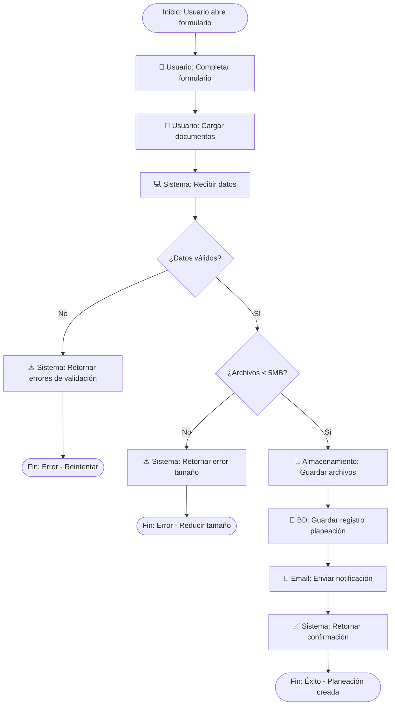

# PROMPT TÉCNICO: Generador de Diagramas de Procesos BPMN 2.0 / Flujos

**Versión:** 1.0  
**Audiencia:** Modelos de IA generadores de diagramas  
**Estándar:** BPMN 2.0 / ISO/IEC 19510  
**Contexto:** Sistema ICBF Conecta (Plataforma Django 5.2)

---

## 📋 INSTRUCCIONES PREVIAS AL DIAGRAMA

Antes de generar cualquier diagrama, **DEBES ejecutar estas validaciones**:

### ✅ FASE 1: IDENTIFICACIÓN DE ACTORES

Enumera **TODOS** los actores/roles del proceso:
- Actores humanos (Padre, Madre Comunitaria, Administrador, etc.)
- Actores del sistema (Base de Datos, Email Service, API, Filesystem, etc.)
- Actores externos (si existen: terceros, entidades, servicios)

**Formato:**
```
ACTORES IDENTIFICADOS:
1. [Nombre Actor] - [Tipo: Humano/Sistema/Externo] - [Responsabilidad breve]
2. [...]
```

---

### ✅ FASE 2: LISTADO DE PROCESOS PRINCIPALES

Identifica los **procesos principales** del flujo (sin detalles):
- Inicio: ¿Qué evento gatilla el proceso?
- Objetivo: ¿Qué debe lograrse?
- Fin: ¿Cuál es el resultado esperado?

**Formato:**
```
PROCESOS PRINCIPALES:
- Proceso 1: [Evento inicio] → [Objetivo] → [Evento fin esperado]
- Proceso 2: [...]
```

---

### ✅ FASE 3: DECISIONES CRÍTICAS

Identifica **TODAS** las decisiones/gateways:
- Punto de decisión (¿Qué se evalúa?)
- Condiciones posibles (¿Qué opciones existen?)
- Salidas (¿A dónde va cada condición?)

**Formato:**
```
DECISIONES CRÍTICAS:
1. [Gateway]: ¿[Condición a evaluar]?
   ├─ Sí/Si Condición → [Actividad siguiente]
   └─ No/Si No Condición → [Actividad alternativa]
2. [...]
```

---

### ✅ FASE 4: VALIDACIÓN DE COHERENCIA

Valida **ANTES** de generar el diagrama:

**Checklist de Validación:**
- ☐ ¿Todo actor aparece en al menos una swimlane?
- ☐ ¿Existe un evento de inicio claro?
- ☐ ¿Existe al menos un evento de fin?
- ☐ ¿Todas las actividades tienen entrada y salida?
- ☐ ¿Ninguna tarea está "huérfana"?
- ☐ ¿Cada decisión tiene todas sus ramas etiquetadas?
- ☐ ¿No hay ciclos infinitos sin condición de escape?
- ☐ ¿El flujo va de arriba hacia abajo O izquierda a derecha?
- ☐ ¿Las responsabilidades están separadas por swimlane?
- ☐ ¿El sistema no toma decisiones de negocio como humano?
- ☐ ¿Los nombres son verbos en imperativo + objeto?

**Si algo no cumple:** DETENTE y corrige antes de generar.

---

## 🎯 REQUISITOS OBLIGATORIOS DEL DIAGRAMA

### 1️⃣ TIPO DE DIAGRAMA EXPLÍCITO

**Debes declarar al inicio:**

```
DIAGRAMA: BPMN 2.0 - [Nombre del Proceso]
ESTÁNDAR: ISO/IEC 19510
HERRAMIENTA COMPATIBLE: Mermaid / draw.io / BPMN XML
ALCANCE: [Inicio] a [Fin]
```

---

### 2️⃣ ELEMENTOS OBLIGATORIOS

#### **A) Evento de Inicio**
- Símbolo: Círculo simple `O`
- Tipos permitidos:
  - **None**: Comienza sin condición
  - **Message**: Mensaje recibido
  - **Timer**: Tiempo/programación
  - **Signal**: Señal del sistema
  - **Manual**: Acción manual del usuario

**Ejemplo correcto:**
```
O "Usuario abre formulario" 
  (Evento inicio: Manual por usuario)
```

**Ejemplo incorrecto:**
```
O "Se procesa todo"  ← Vago, no especifica qué inicia
```

---

#### **B) Actividades / Tareas**
- Símbolo: Rectángulo `[____]`
- Nomenclatura **OBLIGATORIA**: Verbo imperativo + Objeto
- Cada actividad **debe** tener responsable (swimlane)
- Duración aproximada es opcional pero recomendada

**Ejemplo correcto:**
```
[Validar credenciales del usuario]
[Guardar documento en carpeta media]
[Enviar email de confirmación]
```

**Ejemplo incorrecto:**
```
[Procesamiento]  ← Vago
[Sistema]        ← No describe qué hace
[Validación]     ← Incompleto, ¿qué se valida?
```

---

#### **C) Decisiones / Gateways**
- Símbolo: Rombo `◇`
- **OBLIGATORIO**: Pregunta clara en formato condicional
- **OBLIGATORIO**: Etiquetar TODAS las ramas de salida
- No puede haber ambigüedad

**Estructura requerida:**
```
         ◇ "¿Condición cumple?"
        / \
       /   \
   "Sí"     "No"
     |        |
   [A]      [B]
```

**Ejemplo correcto:**
```
◇ "¿Archivo < 5MB?"
├─ Sí → [Guardar en media]
└─ No → [Mostrar error y solicitar reintentar]
```

**Ejemplo incorrecto:**
```
◇ "¿Validar?"        ← Pregunta incompleta
├─ Sí → [Continuar]  ← "Continuar" es vago
└─ No → [...]        ← ¿Qué hace con "No"?
```

---

#### **D) Flujos de Secuencia**
- Símbolo: Flechas dirigidas `→`
- **OBLIGATORIO**: Etiquetar si es condicional
- Dirección: Arriba→Abajo O Izquierda→Derecha (NO ambiguo)
- No cruzarse innecesariamente

**Ejemplo correcto:**
```
[Actividad 1] → [Actividad 2] → [Actividad 3]
```

**Con condición:**
```
[Decisión] 
  ├─ "Condición A" → [Rama A]
  └─ "Condición B" → [Rama B]
```

---

#### **E) Evento de Fin**
- Símbolo: Círculo relleno `●`
- **OBLIGATORIO**: Al menos uno
- Tipos permitidos:
  - **None**: Finalización normal
  - **Message**: Envío de mensaje al finalizar
  - **Signal**: Dispara señal
  - **Error**: Finalización por error

**Ejemplo correcto:**
```
[Actividad final] → ● "Proceso completado exitosamente"
```

**Ejemplo incorrecto:**
```
[Actividad] → ●  ← Sin descripción
```

---

### 3️⃣ ESTRUCTURA CORRECTA DEL FLUJO

#### **3.1 Dirección y Flujo**
- ✅ De arriba hacia abajo (vertical) O de izquierda a derecha (horizontal)
- ✅ Flujo continuo sin saltos
- ✅ Cada elemento tiene exactamente una entrada (excepto inicio)
- ✅ Cada elemento tiene exactamente una salida (excepto fin)

**Incorrecto:**
```
[A] ──→ [B]       (salta en el espacio)
         ↓
       [C]

[D] (huérfano, no conectado)
```

**Correcto:**
```
[A] → [B] → [C]
      ↓
    [D] → [E]
```

---

#### **3.2 Ciclos y Retroalimentación**
- ✅ Ciclos permitidos **SOLO si** tienen condición de escape
- ✅ El ciclo debe terminar eventualmente
- ✅ Etiquetar claramente la condición de salida

**Ejemplo correcto (ciclo con escape):**
```
      ┌─→ [Reintentar] ──┐
      │                  │
◇ "¿Válido?" ──No───────→|
  │                      │
  Sí                     │
  │                      │
  └─ [Continuar] ←───────┘
```

---

#### **3.3 Ninguna Tarea Huérfana**
- ✅ Toda actividad debe estar en el flujo principal
- ✅ No puede haber tareas desconectadas

**Incorrecto:**
```
[A] → [B]

[C] ← (desconectada)
```

---

### 4️⃣ SEPARACIÓN DE RESPONSABILIDADES (Swimlanes)

**OBLIGATORIO:** Usar swimlanes para separar actores

#### **Estructura de Swimlanes:**
```
┌─────────────────────────────────────────────────────────┐
│ USUARIO (Madre Comunitaria)                            │
├─────────────────────────────────────────────────────────┤
│ O "Click en Crear Planeación"                          │
│   ↓                                                     │
│ [Completar formulario]                                 │
│   ↓                                                     │
│ [Cargar documentos]                                    │
│   ↓                                                     │
└─────────────────────────────────────────────────────────┤
│ SISTEMA (Backend Django)                               │
├─────────────────────────────────────────────────────────┤
│ [Recibir datos del formulario]                         │
│   ↓                                                     │
│ ◇ "¿Datos válidos?"                                   │
│   ├─ Sí → [Validar tamaño archivos]                   │
│   └─ No → [Retornar errores al usuario]               │
│           ↓                                             │
└─────────────────────────────────────────────────────────┤
│ ALMACENAMIENTO (Filesystem)                            │
├─────────────────────────────────────────────────────────┤
│ [Guardar archivos en /media/{ruta}]                    │
│   ↓                                                     │
└─────────────────────────────────────────────────────────┤
│ EMAIL SERVICE (SMTP)                                   │
├─────────────────────────────────────────────────────────┤
│ [Enviar notificación al administrador]                 │
│   ↓                                                     │
│ ● "Email enviado"                                      │
└─────────────────────────────────────────────────────────┘
```

#### **Reglas de Swimlanes:**
1. ✅ Cada actor tiene su propia carrilera (swimlane)
2. ✅ Las actividades se asignan **correctamente** a su actor:
   - Usuario: Solo acciones manuales (click, escribir, seleccionar)
   - Sistema: Validaciones, lógica, querys, cálculos
   - Almacenamiento: Guardar, leer, eliminar archivos
3. ✅ **NO transferir responsabilidad equivocada:**
   - ❌ Usuario NO ejecuta validaciones de BD
   - ❌ Sistema NO "decide como humano" (ej: "Aprobar solicitud")
   - ❌ Almacenamiento NO hace lógica de negocio

**Ejemplo incorrecto:**
```
┌─ USUARIO
│ [Validar que archivo < 5MB]  ← El usuario NO valida, el sistema sí
│ [Decidir si procesar]         ← El usuario NO decide lógica

┌─ SISTEMA
│ [Mostrar al usuario]          ← Sistema NO "muestra", envía respuesta
```

---

### 5️⃣ NIVEL DE ABSTRACCIÓN ADECUADO

#### **❌ NO INCLUIR (Demasiado técnico):**
- Detalles de código: `query = Nino.objects.filter(...)`
- Nombres de tablas: `INSERT INTO usuarios WHERE...`
- Frameworks: `Django ORM`, `REST API call`
- Librerías: `xhtml2pdf`, `Pillow`, `EmailMessage`
- Configuración técnica: `.env`, `settings.py`

#### **✅ SÍ INCLUIR (Reglas de negocio):**
- Validaciones lógicas: "¿Archivo < 5MB?"
- Decisiones de negocio: "¿Rol = madre_comunitaria?"
- Requisitos funcionales: "Enviar email a administrador"
- Estados y cambios: "Cambiar estado a APROBADO"
- Integraciones lógicas: "Guardar en sistema de archivos"

**Ejemplo incorrecto:**
```
[Conectar a BD con sqlite3]
[Ejecutar: SELECT * FROM ninos WHERE is_deleted=False]
[Usar ORM Django con query optimization]
[Llamar endpoint /api/municipios?dep_id=5]
```

**Ejemplo correcto:**
```
[Conectar a base de datos]
[Obtener niños activos del hogar]
[Aplicar filtros de búsqueda]
[Llamar servicio de municipios]
```

---

### 6️⃣ REGLAS DE CALIDAD Y NOMENCLATURA

#### **6.1 Nombres Claros y Consistentes**

**Regla: Verbo imperativo + Objeto**

```
✅ CORRECTO              ❌ INCORRECTO
─────────────────────────────────────────
Validar credenciales    Validación
Guardar documento       Guardar
Enviar email            Email
Crear usuario           Crear
Mostrar error           Error
Cambiar estado          Estado
Obtener datos           Datos
Registrar evento        Evento
```

**Consistencia de nomenclatura:**
```
✅ Correcto (consistente)
- [Validar email del usuario]
- [Validar tamaño de archivo]
- [Validar permisos de acceso]

❌ Incorrecto (inconsistente)
- [Validar email del usuario]
- [Verificar tamaño de archivo]      ← Usa "Verificar"
- [Chequear permisos de acceso]      ← Usa "Chequear"
```

---

#### **6.2 Un Proceso con Objetivo Claro**

Cada proceso debe tener:
1. **Inicio claro**: ¿Qué dispara el proceso?
2. **Objetivo único**: ¿Qué se intenta lograr?
3. **Fin claro**: ¿Cuándo termina y cuál es el resultado?

```
✅ CORRECTO
Proceso: INSCRIPCIÓN DE MADRE COMUNITARIA
Inicio: Solicitud recibida
Objetivo: Validar datos y crear usuario
Fin: Usuario creado y email enviado

❌ INCORRECTO
Proceso: USUARIO
Inicio: Usuario hace algo
Objetivo: Procesar
Fin: Termina (¿Cuándo?)
```

---

#### **6.3 Diagrama Autoexplicativo**

El diagrama **DEBE poder entenderse sin explicación adicional.**

✅ Checklist:
- ¿Alguien que no conoce el sistema lo entiende?
- ¿Las preguntas en gateways son claras?
- ¿Todos los términos son de negocio (no técnicos)?
- ¿La secuencia es lógica y natural?
- ¿No hay ambigüedades?

---

## 📐 FORMATO DE SALIDA OBLIGATORIO

### **Formato 1: Descripción Textual Paso a Paso**

```
PROCESO: [Nombre del Proceso]

INICIO: [Evento de inicio]

PASOS:
1. [Actor] realiza: [Actividad]
2. [Actor] realiza: [Actividad]
3. [Sistema] evalúa: ¿[Condición]?
   - Si [Condición]: → PASO 4
   - Si No [Condición]: → PASO 6
4. [Actor] realiza: [Actividad]
5. [Sistema] realiza: [Actividad]
6. [Sistema] realiza: [Actividad de error]
...

FIN: [Evento de fin - Resultado]
```

**Ejemplo:**
```
PROCESO: Crear Planeación Educativa

INICIO: Madre comunitaria hace click en "Crear Planeación"

PASOS:
1. Usuario: Abre formulario de nueva planeación
2. Usuario: Completa datos (período, dimensiones, objetivos)
3. Usuario: Carga documentos (máx 5 archivos de 5MB cada)
4. Sistema: Recibe formulario y datos
5. Sistema: Valida campos requeridos
   - Si válido: → PASO 6
   - Si inválido: → PASO 12
6. Sistema: Valida tamaño de cada archivo
   - Si todos < 5MB: → PASO 7
   - Si alguno > 5MB: → PASO 12
7. Almacenamiento: Guarda archivos en /media/planeaciones/{id}/
8. BD: Registra planeación con estado ACTIVA
9. Email Service: Envía notificación a administrador
10. Sistema: Retorna confirmación al usuario
11. Usuario: Ve mensaje "Planeación creada exitosamente" + PDF preview

FIN: Planeación creada y guardada en el sistema
```

---

### **Formato 2: Mermaid (Compatible con GitHub)**



---

### **Formato 3: BPMN XML (Exportable a herramientas)**

```xml
<?xml version="1.0" encoding="UTF-8"?>
<bpmn:definitions 
    xmlns:bpmn="http://www.omg.org/spec/BPMN/20100524/MODEL"
    xmlns:bpmndi="http://www.omg.org/spec/BPMN/20100524/DI"
    id="Definitions_Process">
    
    <bpmn:process id="Process_CreatePlanning" isExecutable="true">
        
        <!-- Inicio -->
        <bpmn:startEvent id="StartEvent_1" name="Usuario abre formulario">
            <bpmn:outgoing>Flow_1</bpmn:outgoing>
        </bpmn:startEvent>
        
        <!-- Actividad: Usuario completa formulario -->
        <bpmn:userTask id="Activity_UserFill" name="Completar formulario">
            <bpmn:incoming>Flow_1</bpmn:incoming>
            <bpmn:outgoing>Flow_2</bpmn:outgoing>
        </bpmn:userTask>
        
        <!-- Actividad: Usuario carga documentos -->
        <bpmn:userTask id="Activity_Upload" name="Cargar documentos">
            <bpmn:incoming>Flow_2</bpmn:incoming>
            <bpmn:outgoing>Flow_3</bpmn:outgoing>
        </bpmn:userTask>
        
        <!-- Actividad: Sistema valida datos -->
        <bpmn:serviceTask id="Activity_Validate" name="Validar datos">
            <bpmn:incoming>Flow_3</bpmn:incoming>
            <bpmn:outgoing>Flow_4</bpmn:outgoing>
        </bpmn:serviceTask>
        
        <!-- Gateway: ¿Datos válidos? -->
        <bpmn:exclusiveGateway id="Gateway_ValidCheck" name="¿Datos válidos?">
            <bpmn:incoming>Flow_4</bpmn:incoming>
            <bpmn:outgoing>Flow_Yes</bpmn:outgoing>
            <bpmn:outgoing>Flow_No</bpmn:outgoing>
        </bpmn:exclusiveGateway>
        
        <!-- Rama: Sí, datos válidos -->
        <bpmn:serviceTask id="Activity_CheckSize" name="Validar tamaño archivos">
            <bpmn:incoming>Flow_Yes</bpmn:incoming>
            <bpmn:outgoing>Flow_5</bpmn:outgoing>
        </bpmn:serviceTask>
        
        <!-- Rama: No, error de validación -->
        <bpmn:sendTask id="Activity_ErrorMsg" name="Mostrar errores de validación">
            <bpmn:incoming>Flow_No</bpmn:incoming>
            <bpmn:outgoing>Flow_Error</bpmn:outgoing>
        </bpmn:sendTask>
        
        <!-- Fin: Error -->
        <bpmn:endEvent id="EndEvent_Error" name="Error - Reintentar">
            <bpmn:incoming>Flow_Error</bpmn:incoming>
        </bpmn:endEvent>
        
        <!-- Fin: Éxito -->
        <bpmn:endEvent id="EndEvent_Success" name="Éxito - Planeación creada">
            <bpmn:incoming>Flow_Success</bpmn:incoming>
        </bpmn:endEvent>
        
        <!-- Secuencias -->
        <bpmn:sequenceFlow id="Flow_1" sourceRef="StartEvent_1" targetRef="Activity_UserFill"/>
        <bpmn:sequenceFlow id="Flow_2" sourceRef="Activity_UserFill" targetRef="Activity_Upload"/>
        <bpmn:sequenceFlow id="Flow_3" sourceRef="Activity_Upload" targetRef="Activity_Validate"/>
        <bpmn:sequenceFlow id="Flow_4" sourceRef="Activity_Validate" targetRef="Gateway_ValidCheck"/>
        <bpmn:sequenceFlow id="Flow_Yes" sourceRef="Gateway_ValidCheck" targetRef="Activity_CheckSize">
            <bpmn:conditionExpression>Sí</bpmn:conditionExpression>
        </bpmn:sequenceFlow>
        <bpmn:sequenceFlow id="Flow_No" sourceRef="Gateway_ValidCheck" targetRef="Activity_ErrorMsg">
            <bpmn:conditionExpression>No</bpmn:conditionExpression>
        </bpmn:sequenceFlow>
        <bpmn:sequenceFlow id="Flow_Error" sourceRef="Activity_ErrorMsg" targetRef="EndEvent_Error"/>
        <bpmn:sequenceFlow id="Flow_5" sourceRef="Activity_CheckSize" targetRef="EndEvent_Success"/>
        <bpmn:sequenceFlow id="Flow_Success" sourceRef="Activity_CheckSize" targetRef="EndEvent_Success"/>
        
    </bpmn:process>
</bpmn:definitions>
```

---

### **Formato 4: draw.io JSON (Importable)**

```json
{
  "mxGraphModel": {
    "root": [
      {
        "mxCell": {
          "@id": "0"
        }
      },
      {
        "mxCell": {
          "@id": "StartEvent",
          "@parent": "1",
          "mxGeometry": {
            "@x": "50",
            "@y": "50",
            "@width": "100",
            "@height": "60",
            "@as": "geometry"
          },
          "@value": "Inicio: Usuario abre formulario"
        }
      }
    ]
  }
}
```

---

## 🔍 CHECKLIST FINAL ANTES DE GENERAR

**Ejecuta estos pasos en orden:**

### ✅ PASO 1: Listar Actores
```
□ Identifiqué TODOS los actores (humanos y sistema)
□ Cada actor tiene una responsabilidad clara
□ Cada actor aparecerá en una swimlane
```

### ✅ PASO 2: Definir Procesos Principales
```
□ Identifiqué el evento de inicio
□ Definí el objetivo del proceso
□ Identifiqué el/los evento(s) de fin
□ El proceso es atómico (no incluye otros procesos)
```

### ✅ PASO 3: Identificar Decisiones
```
□ Enumeré TODAS las decisiones (gateways)
□ Cada decisión tiene una pregunta clara
□ Cada decisión tiene TODAS sus ramas etiquetadas
□ No hay decisiones sin salida
```

### ✅ PASO 4: Validar Coherencia
```
□ Cada actividad tiene entrada y salida
□ No hay tareas "huérfanas"
□ El flujo es continuo (sin saltos lógicos)
□ Las responsabilidades están en la swimlane correcta
□ Los ciclos tienen condición de escape
□ Los nombres usan verbo + objeto
□ El nivel de abstracción es correcto (sin código)
□ El diagrama es autoexplicativo
```

### ✅ PASO 5: Validar Estructura BPMN
```
□ Existe event de inicio
□ Existen actividades/tareas
□ Existen decisiones (si aplica)
□ Existen eventos de fin
□ Todos los elementos están conectados
□ No hay elementos desconectados
```

---

## 📝 CUANDO GENERES EL DIAGRAMA

**Incluye obligatoriamente:**

1. **Encabezado:**
   ```
   DIAGRAMA: BPMN 2.0 - [Nombre del Proceso]
   ESTÁNDAR: ISO/IEC 19510
   FECHA: [Fecha]
   VERSIÓN: [Versión]
   ALCANCE: Desde [Inicio] hasta [Fin]
   ```

2. **Sección: Actores**
   ```
   ACTORES IDENTIFICADOS:
   1. [Actor] - [Tipo] - [Responsabilidad]
   ...
   ```

3. **Sección: Descripción Textual**
   ```
   FLUJO PASO A PASO:
   1. [Actor] realiza...
   ...
   ```

4. **Sección: Diagrama Visual**
   - Mermaid (preferible para documentación)
   - O ASCII art mejorado
   - O referencia a importar en draw.io

5. **Sección: Notas y Observaciones**
   ```
   NOTAS:
   - [Regla de negocio importante]
   - [Excepción o caso especial]
   - [Integración con otro proceso]
   ```

---

## ⚠️ ERRORES COMUNES A EVITAR

| ❌ Error | ✅ Solución |
|---------|-----------|
| Swimlanes sobrepuestos | Cada actor en su carril separado |
| Actividades vagas | Verbo imperativo + objeto claro |
| Gateway sin etiquetar | Etiquetar Sí/No o todas las ramas |
| Tarea huérfana | Conectar con secuencia o eliminar |
| Ciclo infinito | Agregar condición de escape |
| Demasiado detalle técnico | Usar términos de negocio |
| Falta evento de fin | Agregar al menos un evento de fin |
| Sistema decide como humano | Mover a la swimlane del usuario |
| Usuario ejecuta lógica | Mover a la swimlane del sistema |
| Flujo ambiguo | Clarificar preguntas en gateways |

---

## 🎯 EJEMPLO COMPLETO (Referencia)

**Disponible en:** `DIAGRAMA_PROCESOS_SISTEMA.md` (secciones 4, 5, 6)

Usa como modelo el flujo "Inscripción de Madre Comunitaria" o "Crear Planeación Educativa".

---

## 📚 REFERENCIAS NORMATIVAS

- **BPMN 2.0:** [OMG.org - Business Process Model and Notation](https://www.omg.org/spec/BPMN/2.0/)
- **ISO/IEC 19510:** Estándar internacional para modelado de procesos
- **Notación Mermaid:** [mermaid.js.org](https://mermaid.js.org)
- **draw.io:** [app.diagrams.net](https://app.diagrams.net)

---

---

# 🚀 RESUMEN EJECUTIVO DEL PROMPT

Este prompt **OBLIGA** a cumplir:

✅ Tipo explícito (BPMN 2.0)  
✅ Elementos completos (inicio, actividades, decisiones, fin)  
✅ Estructura correcta (sin ciclos infinitos, sin huérfanos)  
✅ Swimlanes con responsabilidades claras  
✅ Nivel de abstracción adecuado  
✅ Nomenclatura consistente  
✅ Validación previa (actores, procesos, decisiones, coherencia)  
✅ Múltiples formatos de salida  
✅ Checklist de calidad  

**Resultado:** Diagramas profesionales, ISO/IEC 19510 compliant, reutilizables en herramientas BPMN.
